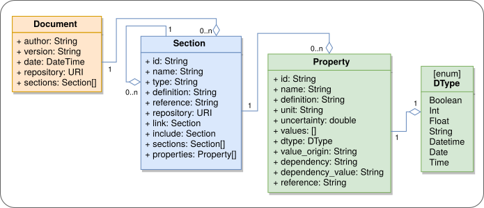

# odml data model

Data exchange requires that also annoations, metadata, are
exchanged. In oder to allow interoperability we need both a common
(meta) data model, the format in which the metadata are exchanged, and
a common terminology.

Here, we briefly describe the *odML* data model. It is based on
the idea of key-value pairs like ``temperature = 26°C``.

The model is as simple as possible while being flexible, allowing
interoperability, and being customizable. The model defines four
entities (Property, Section, Value, RootSection) whose relations and
elements are shown in the figure below.

Property and Section are the core entities. A Section contains
Properties and can further have subsection thus building a tree-like
structure. The model does not constrain the content, which offers the
flexibility essential for comprehensive annotation of neuroscience
data.
