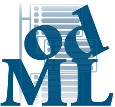

# odML



odML (open metadata Markup Language) is a file format for storing
arbitrary metadata. The underlying [data model](./data_model.md)
offers a way to store metadata in a structured human- and
machine-readable way. Well organized metadata management is a key
component to guarantee reproducibility of experiments and to track
provenance of performed analyses.


*python-odml* is the python library for reading and writing odml metadata files.
It is a registered research resource with the
[RRID:SCR_001376](https://scicrunch.org/browse/resources/SCR_001376)
.

## The odML eco system

### APIs

- [*odml* python library](https://github.com/g-node/python-odml "python library for odml files"). Python library for reading and writing odml files.
- [*java-odml-lib*](https://github.com/g-node/odml-java-lib "Java library for odml files") Java implementation of the data model.
- [*matlab-odml*](https://github.com/g-node/matlab-odml "Matlab interface for odml files") Matlab interface for odml files.

### Viewer/Editor

- [odml-ui](https://github.com/g-node/odml-ui "odml-ui - editor for odml metadata files"): Graphical editor
- [odmlTables](https://github.com/INM-6/python-odmltables) Spreadsheet interface (by INM-6 FZ JÛlich) for odml files.


### Terminologies
*odML* facilitates and encourages standardization by providing
[terminologies](https://github.com/G-Node/odml-terminologies). An
odml-file can be based on such a terminology. In that case one does
not need to provide definitions since they are part of the linked
terminology.

Existing terminologies can be browsed and imported from 
[terminologies.g-node.org](https://terminologies.g-node.org).


### Templates
Templates are odML documents that can be re-used when collecting the same kind of
information over the course of multiple identical experiments.

Templates that were created using the odML terminologies and are used to
systematically collect metadata during scientific experiments can be found, 
discussed and shared at the
[templates github repository](https://github.com/G-Node/odml-templates).

If you have created your own templates that others might find useful, 
you are encouraged to share your templates via this repository.

Currently available odML templates can be browsed and imported from
[templates.g-node.org](https://templates.g-node.org).


* * *

## Getting started

### Installation

*python-odml* is most conveniently installed via pip.

```
pip install odml
```

### Tutorial and examples

- We have assembled a set of
 [tutorials](http://github.com/G-Node/python-odml/blob/master/doc/tutorial.rst "Python Tutorial").

### Python convenience scripts

The Python installation features multiple convenience commandline scripts.

- `odmlconversion`: Converts odML files of previous file versions into the current one.
- `odmltordf`: Converts odML files to the supported RDF version of odML.
- `odmlview`: Render and browse local XML odML files in the webbrowser.

All scripts provide detailed usage descriptions by adding the `help` flag to the command.

    odmlconversion -h
    odmltordf -h
    odmlview -h

### odML - NIX conversion script

You can also find a command line script for importing metadata from odML files into the
second, more data centric, data format, [NIX](https://g-node.github.io/nix/), or
exporting metadata from a NIX file to a new odML file.

You can install the command line script via pip:


    pip install nixodmlconverter


The script can then be run from the command line and provides a detailed usage
description by adding the `help` flag to the command.


    nixodmlconverter -h


The source code of the converter can be found
[on github](https://github.com/G-Node/nix-odML-converter).


## Support

If you experience problems using *odml* feel free to join our IRC channel
[#gnode at FreeNode](irc://irc.freenode.net/gnode) or write an email to <dev@g-node.org>.
If you find a bug please report it using the
[project issue tracker](https://github.com/G-Node/python-odml/issues "pyhton-odml issue tracker").


## License

This project is open source published under an MIT license-like see
[license file](https://github.com/G-Node/python-odml/blob/master/LICENSE) for details.

* * *

## Citing

If you use *odml*, it would be much appreciated if you would cite it in publications with
its identifier RRID:SCR_001376 and/or the reference:

*Grewe J., Wachtler T., and Benda J. (2011). A bottom-up approach to data annotation in neurophysiology. Front. Neuroinform. 5:16, [doi:10.3389/fninf.2011.00016](https://doi.org/10.3389/fninf.2011.00016)*


### Referenced By

- Dragly et al (2018) [doi:10.3389/fninf.2018.000169](https://doi.org/10.3389/fninf.2018.000169)
- Brochier et al (2018) [doi:10.1038/sdata.2018.55](https://doi.org/10.1038/sdata.2018.55)
- Moucek et al (2017) [doi:10.1038/sdata.2016.121](https://doi.org/10.1038/sdata.2016.121)
- Papez et al (2017) [doi:10.3389/fninf.2017.00024](https://doi.org/10.3389/fninf.2017.00024)
- Bigdely-Shamlo et al (2016) [doi:10.3389/fninf.2016.00007](https://doi.org/10.3389/fninf.2016.00007)
- Rübel et al (2016) [doi:10.3389/fninf.2016.00048](https://doi.org/10.3389/fninf.2016.00048)
- Wiener et al (2016) [doi:10.1016/j.neuron.2016.10.037](https://doi.org/10.1016/j.neuron.2016.10.037)
- Zehl et al (2016) [doi:10.3389/fninf.2016.00026](https://doi.org/10.3389/fninf.2016.00026)
- Jayapandian et al (2015) [doi:10.3389/fninf.2015.00004](https://doi.org/10.3389/fninf.2015.00004)
- Jezek et al (2015) [doi:10.3389/fninf.2015.00003](https://doi.org/10.3389/fninf.2015.00003)
- Kocaturk et al (2015) [doi:10.3389/fnbot.2015.00008](https://doi.org/10.3389/fnbot.2015.00008)
- Maccione et al (2015) [doi:10.1016/j.brainresbull.2015.07.008](https://doi.org/10.1016/j.brainresbull.2015.07.008)
- Vanek et al (2015) [doi:10.1109/Informatics.2015.7377849](https://doi.org/10.1109/Informatics.2015.7377849)
- Garcia et al (2014) [doi:10.3389/fninf.2014.00010](https://doi.org/10.3389/fninf.2014.00010)
- Moucek et al (2014) [doi:10.3389/fninf.2014.00020](https://doi.org/10.3389/fninf.2014.00020)
- Sobolev et al (2014) [doi:10.3389/fninf.2014.00015](https://doi.org/10.3389/fninf.2014.00015)
- Cockfield et al (2013) [doi:10.3389/fninf.2013.00020](https://doi.org/10.3389/fninf.2013.00020)
- Papez et al (2013) [doi:10.1109/BIBM.2013.6732554](https://doi.org/10.1109/BIBM.2013.6732554)
- Bakker et al (2012) [doi:10.3389/fninf.2012.00030](https://doi.org/10.3389/fninf.2012.00030)
